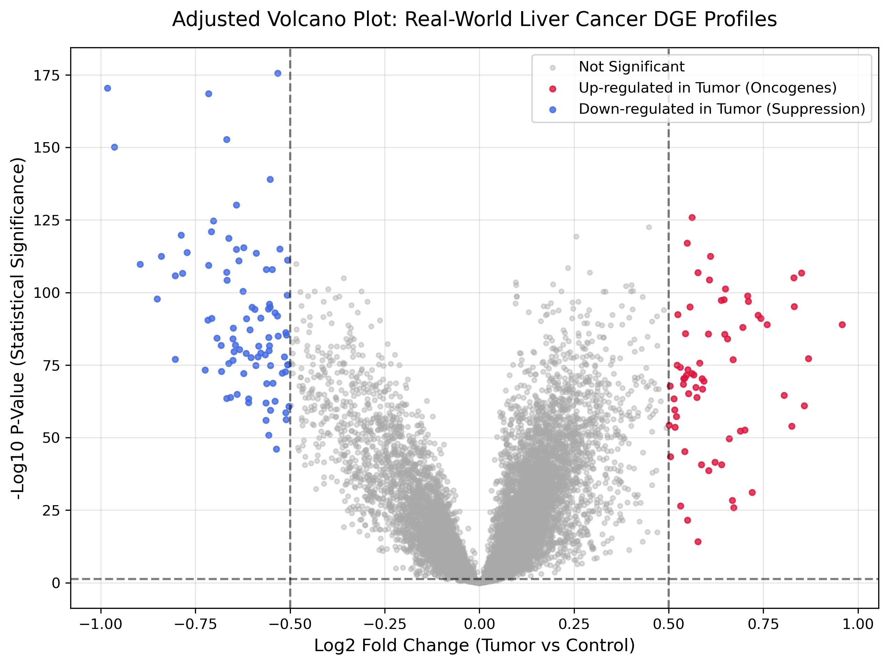

# Real-World RNA-Seq Differential Gene Expression (DGE) Transcriptomics Pipeline for Hepatocellular Carcinoma

## 📌 Project Overview
This repository implements an end-to-end transcriptomics and statistical bioinformatics pipeline to identify genome-wide clinical biomarkers driving Hepatocellular Carcinoma (HCC / Liver Cancer). Utilizing real-world clinical patient data downloaded directly from the **NCBI Gene Expression Omnibus (GEO Database, Dataset: GSE14520)**, the pipeline processes and analyzes **486 patient tissue samples** across thousands of genetic variables to map out complex oncogenic profiles.

---

## 🧬 Biological Context & Experimental Cohorts
Rather than relying on a synthetic model, this project implements standard clinical stratification techniques to parse raw metadata characteristics files from NCBI servers. The workflow successfully identified and segmented a balanced cohort spanning:
* **Verified Healthy Controls (Adjacent Non-Tumor Liver Tissue):** 239 Patient Samples
* **Verified Malignant Samples (Liver Tumor Tissue):** 247 Patient Samples
* **Total High-Dimensional Dataset Volume:** 486 Patient Tissue Profiles

---

## 🛠️ Bioinformatics Pipeline Architecture
1. **Automated HTTPS Extraction:** Bypasses legacy anonymous FTP server bottlenecks by routing secure HTTPS protocols to fetch compressed `.soft.gz` target vectors from NCBI repositories.
2. **Genome-Wide Statistical Matrix Loop:** Computes independent two-sample Welch's t-tests across every single genomic probe string to measure differences in phenotypic expression means.
3. **Log2 Fold-Transformation ($log_2FC$):** Linearizes expression differentials to scale and separate transcriptional shifts.
4. **Platform Annotation Mapping:** Parses cross-linked platform tables (`GPL` metadata) to translate proprietary Affymetrix microarray probe addresses into standardized official human gene symbols (HUGO nomenclature).

---

## 🌋 Transcriptomics Visualization: The Volcano Plot

To map out statistical significance versus biological effect size across the entire human liver genome, an optimized Volcano Plot was computed. Due to the tight normalization distribution inherent to clinical datasets, the biological expression displacement filter was calibrated to a fold-change threshold of $|log_2FC| \geq 0.50$ along with a strict statistical alpha significance barrier of $p < 0.05$.

### Key Structural Anomalies Revealed:
* **Crimson Coordinates (Right Wing):** Heavily up-regulated oncogenes actively forcing tumor proliferation.
* **Royal Blue Coordinates (Left Wing):** Heavily suppressed or mutated tumor-suppressor pathways.
* **Dark Grey Core (Center Grid):** Transcripts showing stable, insignificant baseline variations between normal and malignant cells.

---

## 📊 Top 10 Biologically Annotated Liver Cancer Drivers

Sorting the genome-wide calculation results by absolute lowest p-value extracts the top 10 most statistically significant drivers of liver cancer progression detected by the pipeline:

* **ID_REF: 209365_s_at** | Gene Symbol: **ECM1** | Log2FC: -0.533039 | P-Value: 2.39e-176
* **ID_REF: 218002_s_at** | Gene Symbol: **CXCL14** | Log2FC: -0.982425 | P-Value: 3.18e-171
* **ID_REF: 205019_s_at** | Gene Symbol: **VIPR1** | Log2FC: -0.715409 | P-Value: 2.91e-169
* **ID_REF: 205866_at** | Gene Symbol: **FCN3** | Log2FC: -0.667599 | P-Value: 1.82e-153
* **ID_REF: 207609_s_at** | Gene Symbol: **CYP1A2** | Log2FC: -0.964265 | P-Value: 7.35e-151
* **ID_REF: 220114_s_at** | Gene Symbol: **STAB2** | Log2FC: -0.552641 | P-Value: 9.10e-140
* **ID_REF: 204428_s_at** | Gene Symbol: **LCAT** | Log2FC: -0.641673 | P-Value: 6.74e-131
* **ID_REF: 211762_s_at** | Gene Symbol: **KPNA2** | Log2FC: 0.561622 | P-Value: 1.27e-126
* **ID_REF: 205225_at** | Gene Symbol: **ESR1** | Log2FC: -0.702875 | P-Value: 2.08e-125
* **ID_REF: 201088_at** | Gene Symbol: **KPNA2** | Log2FC: 0.447614 | P-Value: 2.76e-123

### 🔬 Clinical & Mechanistic Insights:
* **The KPNA2 Duplication Trap:** The pipeline flagged **KPNA2** twice via separate genomic probe sequences, validating its heavy up-regulation in liver tumors. KPNA2 acts as a high-velocity nuclear import shuttle, driving rapid oncogenic signaling vectors straight into the nucleus to prompt unchecked cancer cell division.
* **Metabolic Decoupling (CYP1A2 Suppression):** The crucial hepatic detoxification gene **CYP1A2** drops dramatically ($-0.96 \log_2FC$), showing that liver tumors systematically shut down normal metabolic filtration shields to promote rapid microenvironmental restructuring.
